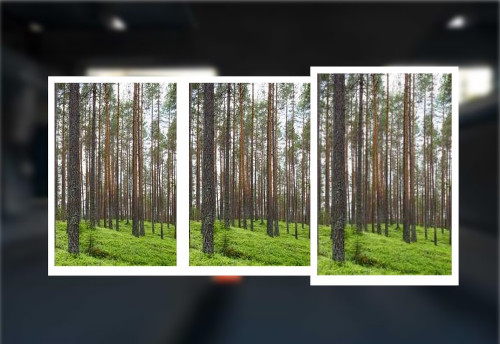
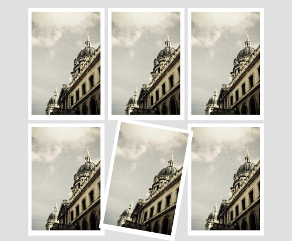

# Заняття 20

## Kahoot

---

## Повторення

### CSS Flexbox та Grid: Створення гнучких макетів

### Flexbox

**Що таке Flexbox?**
Flexbox (Flexible Box Layout) - це модуль CSS, який дозволяє створювати одновимірні макети (рядки або стовпці). Він ідеально підходить для створення адаптивних макетів, де розмір елементів може змінюватися залежно від розміру екрану.

**Основні властивості Flexbox:**

* **display: flex;** - перетворює елемент на контейнер Flex.
* **flex-direction:** Визначає напрямок основної осі (row або column).
* **justify-content:** Вирівнює елементи вздовж основної осі (space-between, center, flex-start, flex-end).
* **align-items:** Вирівнює елементи вздовж поперечної осі (center, flex-start, flex-end).
* **align-content:** Вирівнює кілька рядків або стовпців всередині контейнера.
* **flex-grow:** Визначає, наскільки елемент може розтягуватися, щоб заповнити доступний простір.
* **flex-shrink:** Визначає, наскільки елемент може стискатися, якщо немає достатньо місця.
* **flex-basis:** Визначає початковий розмір елемента перед тим, як він почне розтягуватися або стискатися.

**Коли використовувати Flexbox:**
* Прості макети з одним рядком або стовпцем.
* Вирівнювання елементів всередині контейнера.
* Створення адаптивних макетів.

### CSS Grid

**Що таке CSS Grid?**
CSS Grid - це двовимірна система сіток, яка дозволяє створювати складні макети з декількома рядками та стовпцями. Це потужний інструмент для створення складних макетів, таких як сітки з кількома колонками або нестандартні макети.

**Основні властивості Grid:**
* **display: grid;** - перетворює елемент на контейнер сітки.
* **grid-template-columns:** Визначає ширину стовпців.
* **grid-template-rows:** Визначає висоту рядків.
* **grid-template-areas:** Визначає розміщення елементів в сітці за допомогою імен областей.
* **grid-gap:** Встановлює відступи між елементами.
* **justify-items:** Вирівнює елементи всередині комірок по горизонталі.
* **align-items:** Вирівнює елементи всередині комірок по вертикалі.

**Коли використовувати Grid:**
* Складні макети з багатьма рядками і стовпцями.
* Точний контроль над розміщенням елементів.
* Створення адаптивних макетів з різними розмірами екрану.

### Порівняння Flexbox та Grid

| Ознака | Flexbox | Grid |
|---|---|---|
| Розмірність | Одновимірна | Двовимірна |
| Основне використання | Прості макети, вирівнювання | Складні макети, сітки |
| Гнучкість | Висока для одного рядка або стовпця | Вища для створення складних макетів |

---

## Завдання 1: Flexbox

Створіть веб-сторінку, на якій будуть розміщені три зображення у горизонтальному ряду. Використовуйте Flexbox для вирівнювання елементів, додайте фон для кожного елемента, та анімацію трансформації при наведенні на зображення.

## Завдання 2: CSS Grid

Створіть веб-сторінку, на якій будуть розміщені шість зображень у вигляді сітки 3x2. Використовуйте CSS Grid для розташування елементів, додайте фон для кожного елемента, та анімацію трансформації при наведенні на зображення.

Зображення:

https://picsum.photos/