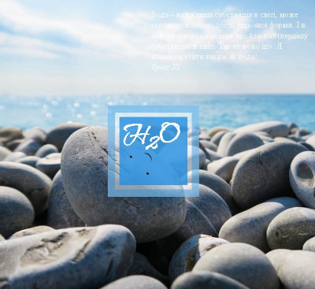

# Заняття 21

## Анімації в CSS: @keyframes

Це CSS-правило, яке дозволяє створювати власні анімації. Воно визначає послідовність змін стилів елемента протягом певного часу.

**Як працюють @keyframes:**

1. **Створення анімації:** Визначається ім'я анімації та ключові кадри (keyframes) - стани елемента в різні моменти часу.
2. **Призначення анімації елементу:** Вибраному елементу присвоюється ім'я анімації та інші параметри, такі як тривалість, затримка, кількість повторень тощо.

**Синтаксис:**

```css
@keyframes ім'я_анімації {
  0% {
    /* стиль для початку анімації */
  }
  25% {
    /* стиль на 25% тривалості анімації */
  }
  50% {
    /* стиль на 50% тривалості анімації */
  }
  100% {
    /* стиль для кінця анімації */
  }
}
```

* **ім'я_анімації:** Унікальне ім'я для анімації, яке буде використовуватися для прив'язки її до елемента.
* **0%, 25%, 50%, 100%:** Ключові кадри, які визначають стан елемента в певний момент часу. Можна використовувати будь-які процентні значення від 0 до 100.
* **стиль:** Значення CSS-властивостей, які будуть застосовані до елемента в цьому ключовому кадрі.

**Приклад:**

```css
@keyframes mymove {
  from {left: 0px;}
  to {left: 200px;}
}

.animate {
  animation-name: mymove;
  animation-duration: 5s;
}
```

У цьому прикладі ми створили анімацію `mymove`, яка переміщує елемент з лівого краю на 200 пікселів праворуч протягом 5 секунд.

**Властивості для керування анімацією:**

* **animation-name:** Вказує ім'я анімації, визначеної за допомогою `@keyframes`.
* **animation-duration:** Задає тривалість одного циклу анімації.
* **animation-timing-function:** Визначає швидкість зміни стилів між ключовими кадрами (linear, ease-in, ease-out, ease-in-out тощо).
* **animation-delay:** Затримка перед початком анімації.
* **animation-iteration-count:** Кількість повторень анімації (infinite для нескінченного повторення).
* **animation-direction:** Напрямок відтворення анімації (normal, reverse, alternate, alternate-reverse).
* **animation-fill-mode:** Визначає стиль відображення елемента до початку і після завершення анімації (none, forwards, backwards, both).


## Завдання 

