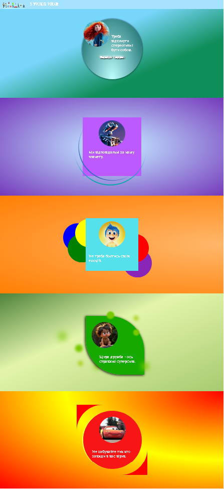

# Заняття 25

## Псевдоелементи

#### **Що таке псевдоелементи?**
Псевдоелементи у CSS — це спеціальні ключові слова, що дозволяють стилізувати певні частини елемента без необхідності додавання нового HTML-коду. Вони допомагають створювати декоративні ефекти або виконувати складне стилізування, яке важко реалізувати іншими способами.

#### **Синтаксис**
Псевдоелементи додаються до селекторів за допомогою подвійної двокрапки `::`. Наприклад:
```css
селектор::псевдоелемент {
  властивість: значення;
}
```
У старіших версіях CSS псевдоелементи могли використовувати однокрапковий синтаксис (наприклад, `:before`), проте сучасний стандарт рекомендує використовувати подвійний формат (`::before`).


#### **Основні псевдоелементи**

##### **`::before`**
Використовується для створення контенту або декоративного елементу перед реальним вмістом елемента.

**Приклад:**
```html
<p>Текст абзацу.</p>
```
```css
p::before {
  content: "→ ";
  color: red;
}
```
**Результат:** Перед абзацом з'явиться стрілочка.


##### **`::after`**
Додає контент або декоративний елемент після реального вмісту елемента.

**Приклад:**
```html
<p>Текст абзацу.</p>
```
```css
p::after {
  content: " ✔";
  color: green;
}
```
**Результат:** Після абзацу з’явиться зелена галочка.


##### **`::first-letter`**
Застосовується до першої літери блочного елемента. Використовується для декоративного форматування, наприклад, стилізації першої літери в абзацах.

**Приклад:**
```html
<p>Перший абзац тексту.</p>
```
```css
p::first-letter {
  font-size: 2em;
  color: blue;
}
```
**Результат:** Перша літера абзацу буде збільшеною та синьою.

##### **`::first-line`**
Стилізує лише перший рядок тексту у блочному елементі.

**Приклад:**
```html
<p>Це дуже довгий текст, щоб продемонструвати ефект роботи псевдоелемента first-line.</p>
```
```css
p::first-line {
  font-weight: bold;
  color: purple;
}
```
**Результат:** Перший рядок абзацу буде жирним і фіолетовим.


#### **Декоративне використання**
Псевдоелементи часто застосовуються для створення декоративних елементів без зміни HTML-коду. Наприклад:
- Створення декоративних іконок або ліній.
- Імітація підказок або спливаючих підказок.
- Створення фону або візуальних елементів.

**Приклад створення кнопки зі стрілкою:**
```html
<button>Перейти</button>
```
```css
button::after {
  content: " →";
  font-size: 1.2em;
  color: #ffffff;
}
```

#### **Увага**
- **`content` є обов’язковим для `::before` і `::after`.** Якщо його не використовувати, псевдоелемент не відобразиться.

--- 

## Завдання

Оформити сторінку так як показано нижче.


Допомога по створенню граждієнта:

- [Css gradient](https://cssgradient.io/)


