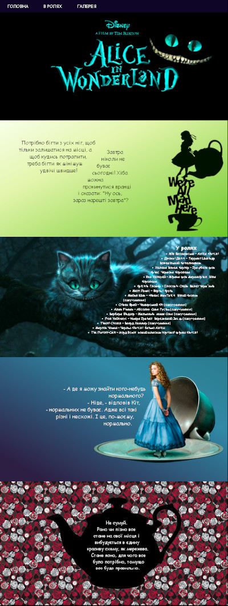

# Заняття 26

## CSS Форми

CSS дозволяє створювати цікаві та нестандартні фігури для ваших веб-елементів без використання графічних редакторів. Це можливо завдяки властивостям `clip-path` і `shape-outside`. Вони надають можливість обрізати елементи або впливати на обтікання текстом різних форм. 

### **Властивість `clip-path`**

#### **Що таке `clip-path`?**
Властивість `clip-path` дозволяє обрізати елементи за заданою формою. Ця функція використовується для створення масок та нестандартних обрізів елементів, таких як квадрати, круги, трикутники тощо.

#### **Синтаксис**
```css
clip-path: форма;
```

#### **Типи фігур у `clip-path`:**

##### 1. **Прямокутник**
```css
clip-path: inset(10px 20px 30px 40px);
```
Це створює внутрішній прямокутник із заданими відступами зверху, справа, знизу і зліва.

##### 2. **Коло**
```css
clip-path: circle(50% at 50% 50%);
```
Обрізає елемент за формою кола з радіусом 50%, яке знаходиться в центрі елемента (50% від ширини та висоти).

##### 3. **Еліпс**
```css
clip-path: ellipse(50% 30% at 50% 50%);
```
Ця форма створює еліпс із шириною 50% та висотою 30%, розміщений у центрі.

##### 4. **Багатокутник**
```css
clip-path: polygon(50% 0%, 100% 100%, 0% 100%);
```
Обрізає елемент у вигляді трикутника. Координати задаються у відсотках (або пікселях) відносно ширини і висоти елемента.


### **Властивість `shape-outside`**

#### **Що таке `shape-outside`?**
Властивість `shape-outside` дозволяє створити нестандартну форму, яка впливає на обтікання текстом. Це робить ваш дизайн більш цікавим і динамічним.

#### **Синтаксис**
```css
shape-outside: форма;
```

#### **Типи фігур у `shape-outside`:**

##### 1. **Коло**
```css
shape-outside: circle(50% at 50% 50%);
```

##### 2. **Еліпс**
```css
shape-outside: ellipse(50% 30% at 50% 50%);
```

##### 3. **Багатокутник**
```css
shape-outside: polygon(50% 0%, 100% 100%, 0% 100%);
```

##### 4. **Зображення як форма**
```css
shape-outside: url('image.png');
```
Обгортання текстом відбувається навколо маски, створеної з контуру зображення.


### **Комбінація `clip-path` та `shape-outside`**

Ці властивості можна використовувати разом. Наприклад, обрізання елемента (`clip-path`) може поєднуватись із формою для обтікання тексту (`shape-outside`), щоб створювати складні дизайни.

### **Анімація фігур**
`clip-path` підтримує анімацію, що дозволяє динамічно змінювати форми елемента.

**Приклад:**
```css
@keyframes animate {
  0% {
    clip-path: circle(50% at 50% 50%);
  }
  100% {
    clip-path: polygon(50% 0%, 100% 100%, 0% 100%);
  }
}

.animated-shape {
  width: 200px;
  height: 200px;
  background-color: orange;
  animation: animate 3s infinite alternate;
}
```

## Завдання

