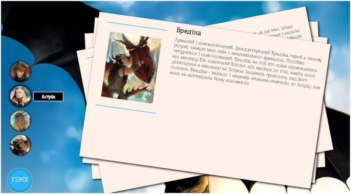

# Заняття 29

## Випадаюче меню. Tooltip

Випадаюче меню (`Dropdown menu`) і **Tooltip** (підказка) можуть бути реалізовані **лише за допомогою HTML та CSS**, без використання JavaScript. Це можливо завдяки селекторам `:hover`, `:focus` та `:checked`.  


### **Випадаюче меню за допомогою CSS (`:hover`)**  
#### **HTML Код**
```html
<!DOCTYPE html>
<html lang="uk">
<head>
    <meta charset="UTF-8">
    <meta name="viewport" content="width=device-width, initial-scale=1.0">
    <title>Випадаюче меню</title>
    <link rel="stylesheet" href="styles.css">
</head>
<body>

    <nav class="menu">
        <ul>
            <li><a href="#">Головна</a></li>
            <li class="dropdown">
                <a href="#">Категорії</a>
                <ul class="dropdown-menu">
                    <li><a href="#">Книги</a></li>
                    <li><a href="#">Фільми</a></li>
                    <li><a href="#">Музика</a></li>
                </ul>
            </li>
            <li><a href="#">Контакти</a></li>
        </ul>
    </nav>

</body>
</html>
```

#### **CSS Стилі**
```css
/* Оформлення меню */
.menu ul {
    list-style: none;
    padding: 0;
    display: flex;
    background: #0077cc;
}

.menu ul li {
    position: relative;
}

.menu ul li a {
    display: block;
    padding: 10px 20px;
    color: white;
    text-decoration: none;
}

/* Випадаюче меню */
.dropdown-menu {
    display: none;
    position: absolute;
    top: 100%;
    left: 0;
    background: #005fa3;
    list-style: none;
    padding: 0;
}

.dropdown-menu li a {
    display: block;
    padding: 10px;
}

/* Показати меню при наведенні */
.dropdown:hover .dropdown-menu {
    display: block;
}
```

➡ **Як це працює?**  
- Коли користувач наводить курсор на **`Категорії`**, його дочірній `<ul class="dropdown-menu">` стає видимим.  
- `position: absolute;` дозволяє меню з’являтися під пунктом основного меню.  

---

### **Tooltip (підказка) без JavaScript**
Tooltip використовується для показу додаткової інформації при наведенні на елемент.

#### **HTML Код**
```html
<p class="tooltip">
    Наведіть курсор для підказки
    <span class="tooltip-text">Це пояснювальний текст</span>
</p>
```

#### **CSS Стилі**
```css
.tooltip {
    position: relative;
    cursor: pointer;
    display: inline-block;
}

.tooltip-text {
    display: none;
    position: absolute;
    bottom: 100%;
    left: 50%;
    transform: translateX(-50%);
    background: black;
    color: white;
    padding: 5px;
    border-radius: 4px;
    white-space: nowrap;
}

/* Показати Tooltip при наведенні */
.tooltip:hover .tooltip-text {
    display: block;
}
```

➡ **Як це працює?**  
- `position: relative;` на основному тексті дозволяє розташувати **підказку** відносно нього.  
- При **наведенні курсору (`:hover`)** підказка **`tooltip-text`** стає видимою.  

---

## Завдання

### Створення інтерактивної сторінки з персонажами фільму "Як приручити дракона"**

**1. Додати загальну структуру сторінки**  
- Використати основні HTML-теги: `<html>`, `<head>`, `<body>`.  
- Вказати `<meta charset="utf-8">` для коректного відображення тексту.  
- Підключити CSS (`<link rel="stylesheet" href="style.css">`).  
- Встановити заголовок сторінки (`<title>How to Train Your Dragon</title>`).  

**2. Створити меню персонажів**  
- Використати `<div class="characters_menu">`, всередині якого буде кнопка з надписом `"ГЕРОЇ"`.  
- Додати список `<ul class="fab-buttons">` з персонажами, кожен `<li>` міститиме посилання (`<a href="#Hiccup">`).  

**3. Додати блоки з інформацією про героїв**  
- Використати `<div class="characters_conteiner">` для загального контейнера.  
- Усередині кожного блоку `<div class="character" id="Hiccup">` додати зображення (``), заголовок (`<h2>`), текст опису (`<p>`).  

**4. Стилізувати сторінку**  
- Використати CSS для оформлення **меню персонажів**, блоку з описом та кнопки `"ГЕРОЇ"`.  
- Додати `position: absolute;` для ефекту плавного відкриття описів.  
- Використати `:hover` для підказки (`.tooltip`).  

**5. Адаптувати сторінку для мобільних пристроїв**  
- Використати `@media` для зміни розташування елементів на різних екранах.  

### **Очікуваний результат**
Користувач може **переглядати персонажів**, натискати на меню та читати їхні **опис** з анімацією.

