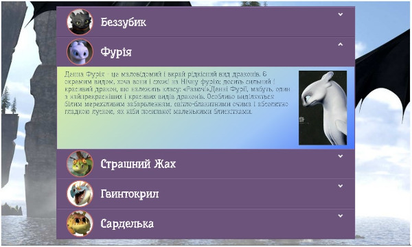

# Заняття 30

## Багаторівневе меню. Checkbox

Багаторівневе меню — це навігаційний елемент, що містить вкладені списки. Використовуючи **checkbox** та CSS, можна створити таке меню **без JavaScript**, просто керуючи його відображенням через `:checked`.  

### **Структура HTML**
```html
<!DOCTYPE html>
<html lang="uk">
<head>
    <meta charset="UTF-8">
    <meta name="viewport" content="width=device-width, initial-scale=1.0">
    <title>Багаторівневе меню</title>
    <link rel="stylesheet" href="styles.css">
</head>
<body>
    <nav class="menu">
        <ul>
            <li>
                <input type="checkbox" id="menu1">
                <label for="menu1">Категорії</label>
                <ul class="submenu">
                    <li><a href="#">Книги</a></li>
                    <li><a href="#">Фільми</a></li>
                    <li>
                        <input type="checkbox" id="menu2">
                        <label for="menu2">Музика</label>
                        <ul class="submenu">
                            <li><a href="#">Рок</a></li>
                            <li><a href="#">Поп</a></li>
                            <li><a href="#">Класична</a></li>
                        </ul>
                    </li>
                </ul>
            </li>
        </ul>
    </nav>
</body>
</html>
```

### **Стилізація у CSS**
```css
/* Базові стилі меню */
.menu ul {
    list-style: none;
    padding: 0;
}

.menu ul li {
    position: relative;
}

/* Ховаємо підменю за замовчуванням */
.submenu {
    display: none;
    padding-left: 20px;
}

/* Показуємо підменю, коли чекбокс активний */
input[type="checkbox"]:checked + label + .submenu {
    display: block;
}

/* Стилізація тексту */
label {
    cursor: pointer;
    font-weight: bold;
    padding: 5px;
    display: block;
}
```

➡ **Як це працює?**  
- Кожен рівень меню містить **checkbox**, який контролює відкриття підменю.  
- `:checked` у CSS визначає, чи вибрано чекбокс, і якщо так, **показує вкладений `<ul class="submenu">`**.  
- Без JavaScript можна реалізувати багаторівневу структуру.

---

## Завдання


