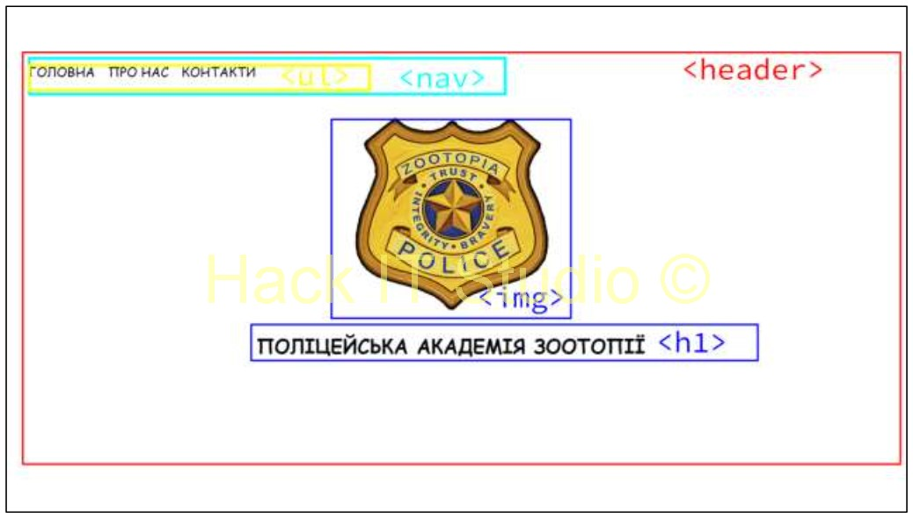
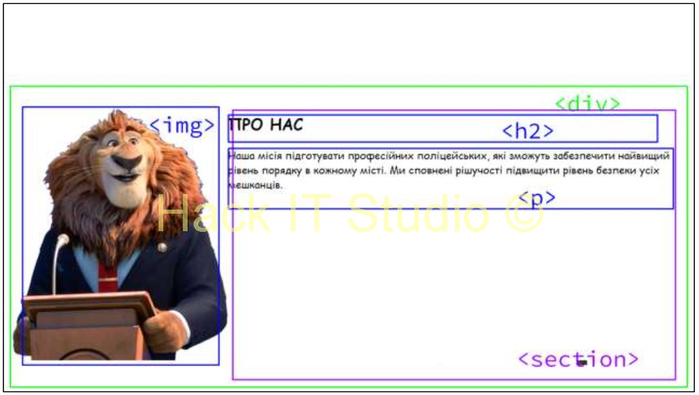
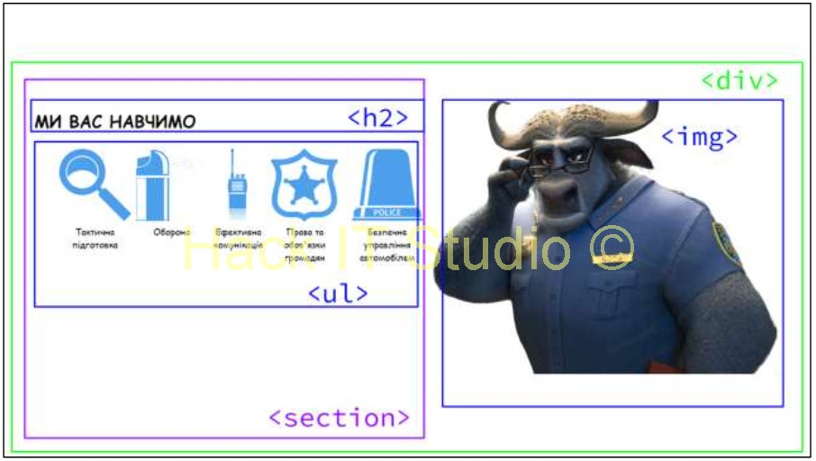
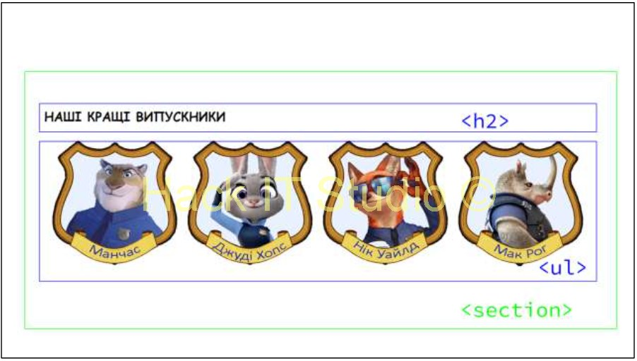
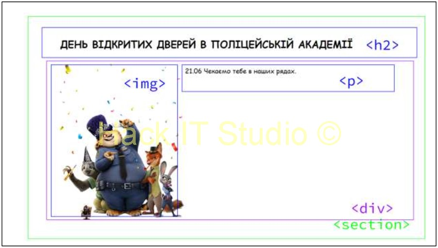
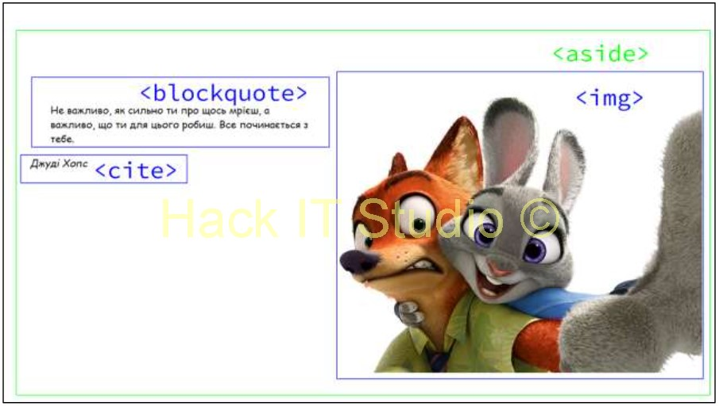
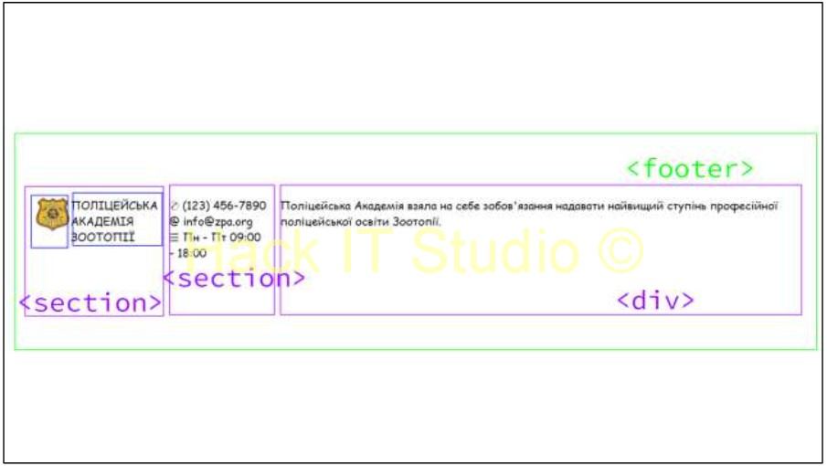

# Заняття 6

## Вивчаємо нові теги

`
` - універсальний контейнер для блоків контенту.

`<section>` - визначає розділ документа.

`<article>` - використовується для самостійних статей або блоків контенту.

`<header>` - визначає заголовок розділу або документа.

`<footer>` - визначає нижній колонтитул розділу або документа.

`<nav>` - використовується для навігаційних блоків.

`<aside>` - визначає додатковий контент, як-от бокові панелі.

`<main>` - визначає основний контент документа.

#### Окрім вже згаданих, є ще кілька HTML тегів, які допомагають структурувати контент на веб-сторінці:

- `<figure>` - використовуються для групування елементів, зокрема зображень і підписів.
    - `<figcaption>` - визначає підпис для елемента \<figure\>.
- `<address>` - використовується для контактної інформації.
- `
` - створює віджет, який користувач може відкрити або закрити для перегляду додаткового контенту.
    - `
` - визначає заголовок для елемента \<details\>.
- `<mark>` - виділяє текст як підсвітку, що привертає увагу.
- `<time>` - визначає дату і час.

---

### Завдання 1.

_Головна, про нас, контакти_ — прописується як звичайний список

### Завдання 2.

У нас є зображення, яке йде паралельно до тексту — це 2 блоки, блок зображення і section з текстом 
	
Зображення, заголовок другого рівня і параграф

### Завдання 3.

У нас є зображення, яке йде паралельно до тексту — це 2 блоки, блок зображення і section з текстом

### Завдання 4.

### Завдання 5.

### Завдання 6.

### Завдання 7.

