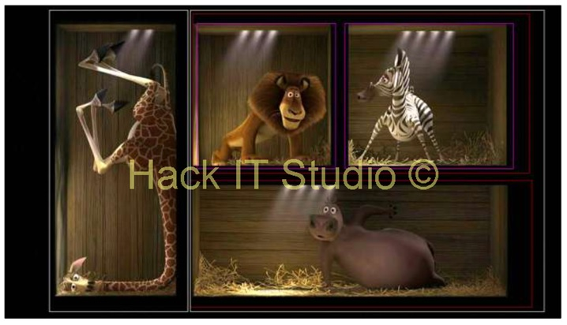

# Заняття 7

### Завдання 1 (повторення)

1. Відкрити файл task1.html
2. Для кожного абзацу задати: колір тексту, фон основи, розмір шрифту, тип шрифту.
3. Для задання кольору використайте різні формати.

## Блочні і рядкові елементи

Відповідно до концепції блочної моделі, кожен елемент на сторінці являє собою прямокутний  блок і може мати ширину, висоту, поля (зовнішні відступи), рамки, і внутрішні відступи.
Елементи сторінки зазвичай діляться на блочні і рядкові. 


	
#### Блочні:
1. До і після блочного елементу існує перенос рядка.
2. Блочним елементам можна задавати ширину, висоту, внутрішні і зовнішні відступи.
3. Вони займають все доступне місце по горизонталі.

```html
<p>, <h1>, <h2>, <div>, <hr>, <ol>, <ul>, <pre> ...
```

#### Рядкові:

1. Розміщуються один за одним в одному рядку, поки достатньо місця. При необхідності переносяться в наступний рядок.
2. До і після розривів рядка немає.
3. Ширина і висота рядкового елементу залежить лише від його змісту.  Задати розміри не можна.
4. Можна задати лише горизонтальні відступи.

```html
<a>, <strong>, <em>, <span>, <b>, <i> ...
```

## Розмітка сайту. Flexbox (display)

Властивість display CSS встановлює, чи розглядається елемент як блоковий або вбудований (рядковий) елемент, а також макет, який використовується для його дочірніх елементів, як-от макет потоку, сітка або гнучкий.

	display: block;
	display: flex;
	display: inline-block;
	display: none;


### Завдання 2.

1. Відкрити файл task2.html
2. Встановіть для першої групи зображень батьківському елементу div значення display: flex;
3. Для другої групи зображень зробіть щоб вони йшли стовпчиком.
Для цього кожному зображеню треба встановити значення 

    display: block;

#### Flexbox (flex-direction, justify-content)

__flex-direction__ - властивість визначає, як елементи розміщуються в контейнері, визначаючи головну вісь і напрямок (нормальний або зворотний).

	flex-direction: row; 
	flex-direction: row-reverse; 
	flex-direction: column; 
	flex-direction: column-reverse; 

__justify-content__ - властивість визначає, як браузер розподіляє простір між елементами між ними та навколо них уздовж головної осі контейнера flex і внутрішньої осі контейнера grid.

	justify-content: flex-start;
	justify-content: flex-end;
	justify-content: center;
	justify-content: space-between;
	justify-content: space-around;
	justify-content: space-evenly;

__align-items__  - властивість вирівнює елементи всередині рядків контейнера в перпендикулярному (горизонтальному) напрямку. У Flexbox він керує вирівнюванням елементів на поперечній осі.
stretch - елементи розтягуються та займають весь доступний простір контейнера.
center - елементи розташовані по центру контейнера.

    flex-start -елементи розташовані на початку контейнера.
    flex-end - елементи розташовані в кінці контейнера.
    baseline - елементи розташовані на базовій лінії контейнера.
    initial - встановлює властивість у значення без задання
    inherit - Вказує на спадковість властивості від свого батьківського елемента (якщо відповідна властивість встановлена)

### Завдання 3.

1. Відкрити файл task3.html
2. Розмістити блоки як на рисунку нижче. 

