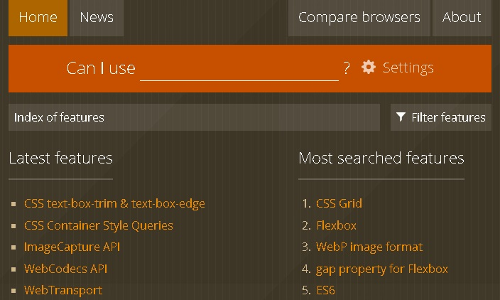
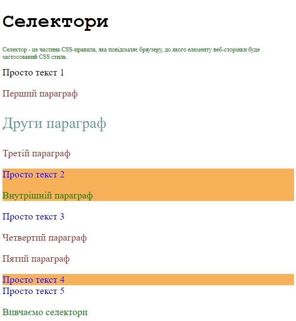
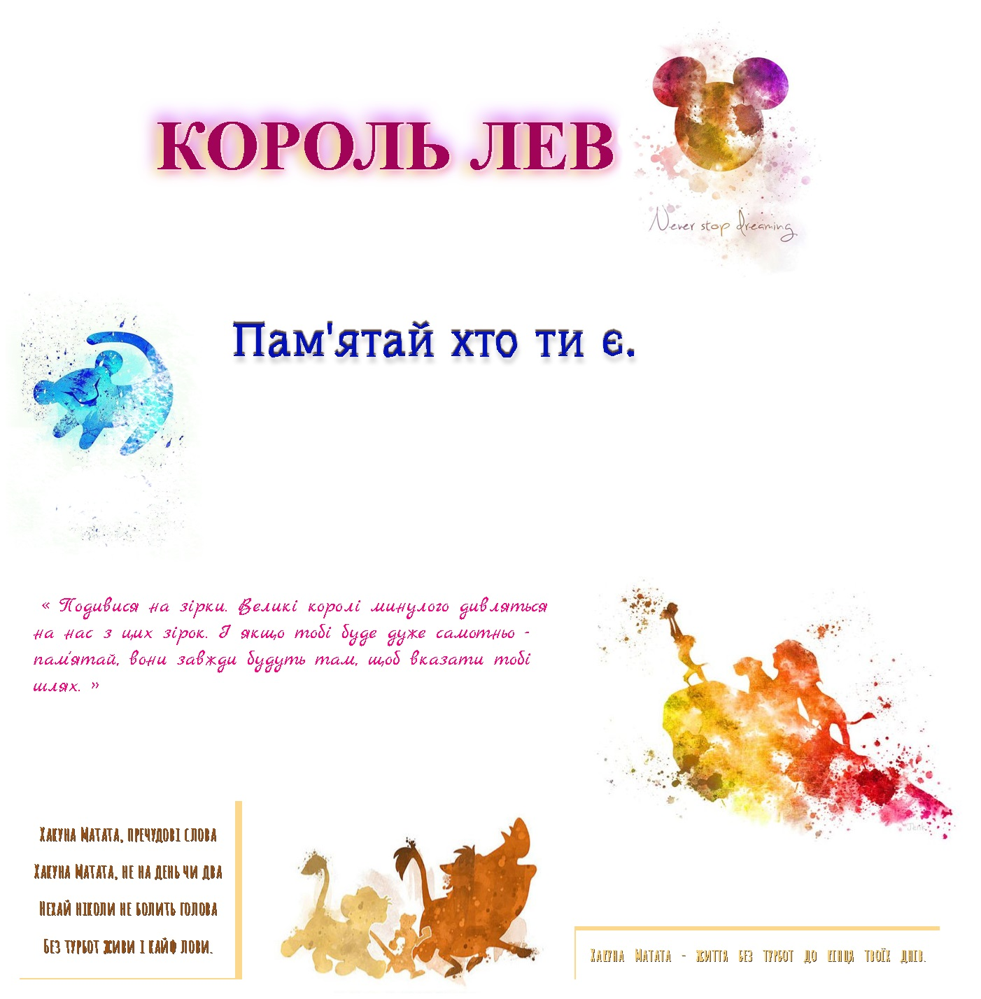

# Заняття 9

### CSS

CSS (Каскадні таблиці стилів [wikipedia](https://uk.wikipedia.org/wiki/CSS)) — це спеціальна мова
стилю сторінок, що використовується для опису їхнього
зовнішнього вигляду. Самі ж сторінки написані мовами розмітки
даних.

Найчастіше CSS використовують для візуальної презентації
сторінок, написаних HTML та XHTML, але формат CSS може
застосовуватися до інших видів XML-документів.

[](https://caniuse.com/)

На сайті можна знайти інформацію про підтримку конкретних функцій у різних версіях браузерів, що допомагає розробникам зробити свої веб-сайти сумісними з більшістю браузерів.


### Повторення 

**Інлайновий стиль** – в середині тегу.

```html
<h1 style=”color:red; text-align:center”> Ваш заголовок </h1>
```

**Внутрішній стиль** – в цьому випадку оформлення сайту задається в контейнері \<style\>, що розміщується в  контейнері \<head\> html-документу. 

```html
<style>
    body {
        background-color: red;
        font-family: Arial;
    }
</style>
```

**Зв’язаний або зовнішній стиль** - ним ми найчастіше користуємось! Створюємо  новий  файл  з  розширенням  __*.css__. Зв’язуємо створений стильовий файл з html-документом за допомогою тегу \<link\> в контейнері \<head\>.

```html
<link href="style.css" rel="stylesheet">
```

### Селектори

__Селектор__ - це частина CSS-правила, яка повідомляє браузеру, до якого елементу веб-сторінки буде застосований CSS стиль.

#### Прості селектори

1.	__div__ 		- по тегу
2.	__.myclass__ 	- по класу
3.	__#header__ 	- по id
4.	__\*__ 			– усі елементи
5. __[src]__		- селектор за атрибутом


#### Складні селектори

1. __div *__ 		— усі дочірні елементи
2.	__.class1.class2__ – одночасно з двома класами (без пропуску)
3.	__p strong__ 	— вкладені 
4.	__ul > li__ 	— тільки першого рівня вкладеності
5.	__div + p__ 	— сусідні, перший параграф що слідує за div
6.	__div ~ p__ 	— всі абзаци які суміжні з div

---

### Завдання 1

1. Відкрити файл task1.html
2. Задайте стилі відповідно до умови записаної в параграфі. Змініть колір тексту і фон основи для кожного параграфу, кольори виберіть самостійно.



### Завдання 2

1. Відкрити файл Lion-King.html
2. Додати стилі, зробити щоб сторінка виглядала так як на зображенні нижче.

Основний шрифт “cursive”, шрифт цитати “Marck Script” 
 		
[fonts.google](https://fonts.google.com/) 



